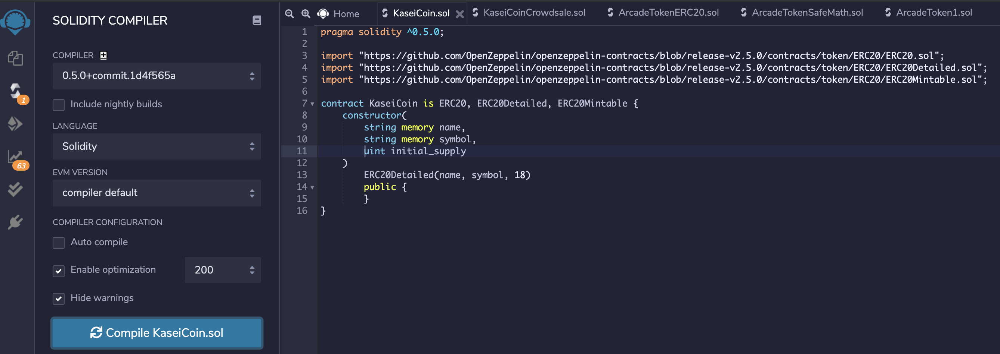
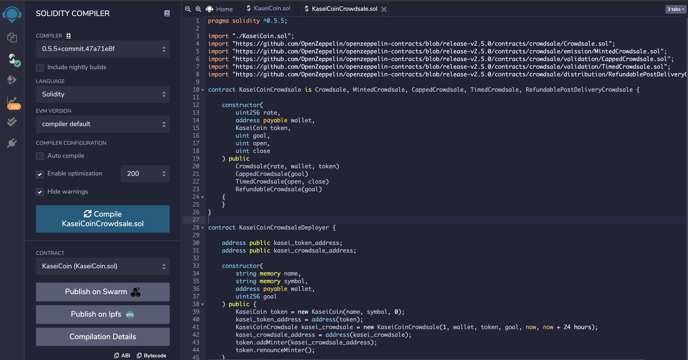
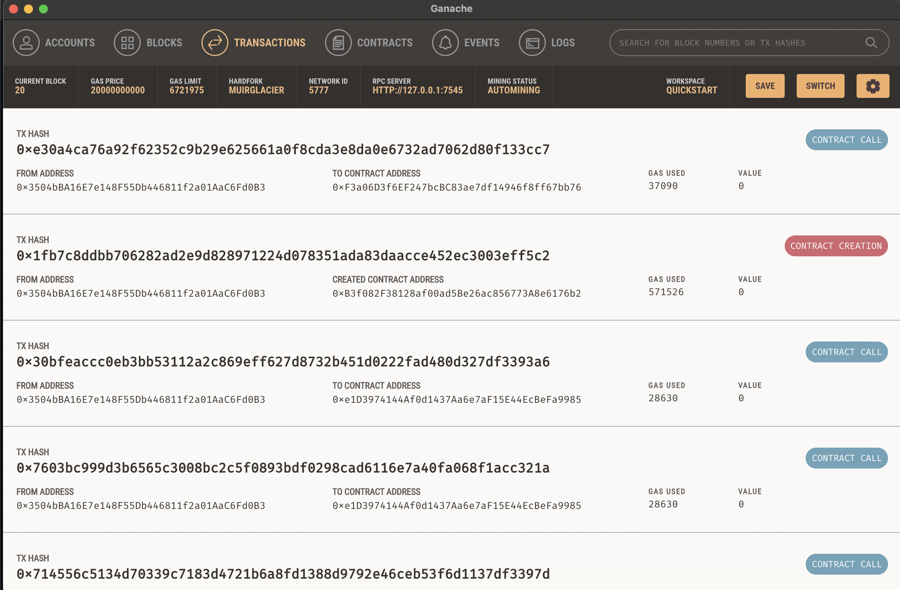

### ERC-20 Fungible Token (KaseiCoin)
A fungible token that is ERC-20 compliant and is being minted by using a Crowdsale contract from the OpenZeppelin Solidity library.

**Overview of the project and project goals**

The crowdsale contract manages the entire crowdsale process, allowing users to send ether to the contract and in return receive KAI, or KaseiCoin tokens. The contract mints the tokens automatically and distribute them to buyers in one transaction.

## Installation

1. Clone repo from GitHub to your computer:

```
git clone https://github.com/JonahLeggett/Fungible_Token.git
```

## Run Remix IDE

To run this smart contract, you can use the Remix IDE. For this purpose, you can use the web version Remix IDE, and you won’t need to install any software.

* [Remix IDE](https://remix.ethereum.org/)

## Instructions (With Screenshots) for using the Smart Contract in Remix IDE

Complete the following steps:

1. Open File in Remix IDE

- From repository, open the Solidity files named KaseiCoin.sol & KaseiCoinCrowdsale.sol in the Remix IDE.

2. Compile the Contracts in the JavaScript VM

- On left pane, select the 'Solidity Compiler' tab, and from the "Compiler" drop down menu select "0.5.5"

- Click "Compile" in the Remix IDE to compile the contracts. 

3. Deploy the Contracts in the JavaScript VM

- In the Remix IDE, navigate to the “Deploy & Run Transactions” pane, and then make sure that “JavaScript VM” is selected as the environment.





- Click the Deploy button to deploy your smart contract, and then confirm that it successfully deployed.

3. Interact with the Deployed Smart Contract

**Use the deployed contracts to:**

1. Deploy the crowdsale to a local blockchain with Remix, MetaMask, and Ganache.

2. Test the functionality of the crowdsale by using test accounts to buy new tokens and then checking the balances.  

3. After purchasing tokens with one or more test accounts, view the total supply of minted tokens and the amount of wei that has been raised in the crowdsale contract.




## License

MIT
